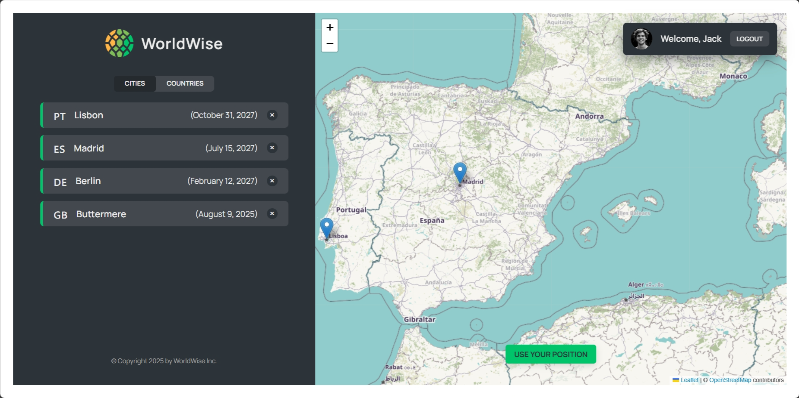

# Worldwise

One of the intermediate projects in Jonas Schmedtmann's Ultimate React Course. A web app where users can register all the cities they have traveled to. Built with React.

Live Demo [here](https://worldwise-jmgf.netlify.app/).

## Technologies Used

- Frontend library - React
- Build tool - Vite
- Routing - React Router
- Styling - CSS Modules
- Mapping - React Leaflet

## Features

- Add to your list of cities traveled to via a map
- Switch between city and country view

## Screenshots

## Usage

The login form is pre-filled with demo account credentials, so you can log in immediately after launching the app.
